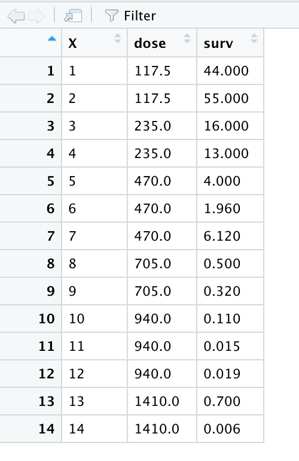
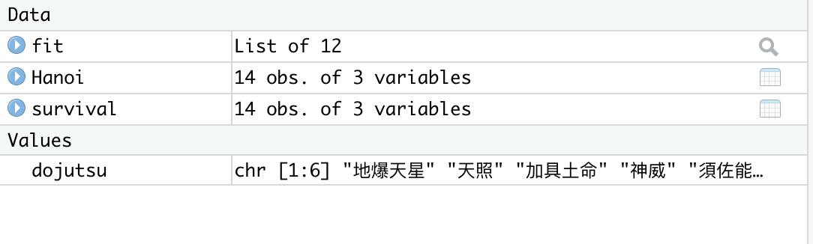
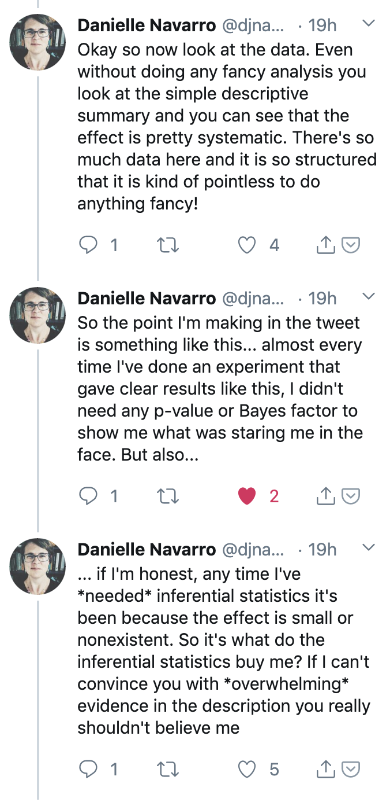

```{r setup, include = FALSE}
library(tidyverse)
library(MASS)
options(htmltools.dir.version = FALSE)
```

```{css, echo=FALSE}
/* custom.css */
.left-code {
  color: #777;
  width: 38%;
  height: 92%;
  float: left;
}
.right-plot {
  width: 60%;
  float: right;
  padding-left: 1%;
}
.plot-callout {
  height: 225px;
  width: 450px;
  bottom: 5%;
  right: 5%;
  position: absolute;
  padding: 0px;
  z-index: 100;
}
.plot-callout img {
  width: 100%;
  border: 4px solid #23373B;
}
```

---
# Getting Data into R
Go to the following site:

https://vincentarelbundock.github.io/Rdatasets/datasets.html 

--

and download the dataset “survival”. We will read this into R using the following command:

```{r}
Hanoi<-read.csv("survival.csv")
```

--

When you read this into R, you should see the following:

---



---



---

As you can see, we use the arrow to assign our dataset to a name. Therefore,when you type "Hanoi" it will show you the dataset that you have loaded into R. 

--

However, R Studio makes things very simple by cutting out this extra step. If you look at R Studio, you’ll note that in the top right corner there’s a box that has the tab *“Environment”*. 

You’ll see that there’s a button that says *“Import dataset”*. You can use this button to quickly import any dataset you desire. Try it now with the "survival" dataset you just imported into R as “Hanoi”.

---

class: center, inverse
background-image: url("images/peaceful-fields.png")

---

# A quick, basic lesson

--

Before we go any further, I must stress that R is very, very particular. If a command goes wrong, it is 99% probable that you did not write the name of the dataset/vector/variable properly, OR that you did not put a parentheses or a comma, or some other form of punctuation where there should be one. The beauty of R studio is that it’s very good at putting parentheses in the right places, but errors still do occur.

--

R is quite simply, an entirely new language. That being said, it operates in an intuitive manner. For instance, try this command:

```{r cars, fig.height=4, dev='svg', results='hide'}
1+1
```

If you press enter, you'll see that it executes the code and gives you the answer, which is

```{r 2,  echo=FALSE, results='show'}
1+1
```

--

Of course, we all know what 1 + 1 is (but imagine if we didn’t!).

---

# Assigning equations to vectors

Now, what if we wanted to assign the value of the equation **1+1** to an object in R? 

.pull-left[
```{r 3, eval = 'false', results= 'hide'}
a <- 1+1
a
```
]
--

.pull-right[
```{r 3-out, ref.label="3", echo=FALSE}
```
]

--

You can see that the value of this equation is stored in the object of *a*. Now, perhaps you can begin to see what kinds of things you can do with this object, e.g.

--
.pull-left[
```{r 4, results = 'hide', eval = 'false'}
a + 56
```
]

--
.pull-right[
```{r 4-out, ref.label="4", echo=FALSE}
```
]

---
class: center, middle

# R is simple enough to understand if you think of it as small **building blocks**, such as `a <- 1+1`, being put together to comprise a whole (the action you are trying to accomplish).

--

### This may not make sense right now, but (hopefully!) will by the end of this course.

---

# Taking a look at our dataset

--

Before starting analysis on a dataset, you need to familiarize yourself with the data. This can be done in R very easily. One command that's useful is the following, on our "Hanoi" dataset:

--

.pull-left[
```{r head, eval = 'false', results = 'hide'}
head(Hanoi)
```
]
--

.pull-right[
```{r head-out, ref.label="head", echo=FALSE}
```
]

--

As you can see, this shows you the top of the dataset (the "head", if you will), which is helpful if one wants to get a quick snapshot of the dataset. 

---

The next command is:

--

.pull-left[
```{r 5, eval = 'false', results = 'hide'}
names(Hanoi)
```
]
--

.pull-right[
```{r 5-out, ref.label="5", echo=FALSE}
```
]

--

Our variables here are "dose" and "survival". To give you some context, this dataset is about the survival of rats after being given radiation doses. "surv" is the survival rate of the batches expressed as a percentage, while "dose" is the dose of radiation administered (rads).

--

Now, it doesn't seem to make sense for our dataset to be called "Hanoi". How do you think we would go about renaming it?

--

```{r 6}
survival <- Hanoi
```

Now, you should see in your top right pane, under "Environment", the dataset `survival`, which is exactly the same as the `Hanoi` dataset.

---

# Summary statistics in R

--

This is very easy to do in R. Simply type the following:

--

```{r 7, eval = 'false', results = 'hide'}
summary(survival)
```


--


```{r 7-out, ref.label="7", echo=FALSE}
```

--

As you can see, this command gives you a nice little snapshot of the data, with means and medians. You can also find the mean for each specific variable by simply typing the following:

.pull-left[
```{r 8, eval = 'false', results = 'hide'}
mean(survival$dose)
```
]

--

.pull-right[
```{r 8-out, ref.label="8", echo=FALSE}
```
]

---

##As you see, this mean is the same as the mean we see in the summary statistics we did with `summary(survival)`.

---

## You probably noticed the use of the "$" operator. This is your way of telling R where to "look". When you type **mean(survival$dose)** you are telling R "I want the mean of the variable *dose* in the *survival* dataset."

--

## Now on your own, try finding the **median** of "surv"

--

You should have typed in the following, and gotten the following result:

--
```{r 9, eval = 'false', results = 'hide'}
median(survival$surv)
```

--

```{r 9-out, ref.label="9", echo=FALSE}

```


---

```{r, out.width = "1400px",echo=FALSE}
knitr::include_graphics("images/bear-vinh.png")

```

---

# How do you make sense of your data?

--

## Traditional Tools  

--

In earlier versions of this lecture, I would tell students to investigate **three key assumptions** (namely, normaility, homogeneity of variances, and whether their samples were indpendent).

--

Nowadays, I don't think those are as important. You absolutely should understand your data, but for social scientists our data is 99%<sup>1</sup> of the time going to be non-normal, and often with wide variances. And as social scientists, we should already know whether our data is dependent or indpendent.

--

.footnote[
[1] Definitely not accurate math.

]

---

### In the old days, we used null hypothesis significance tests (NHST)

--

### These are now rightly criticized for obscuring the "true" effect we can see, and/or being a "lazy" way to interrogate data. Also, there are plenty of instances where it is simply unneccesary to perform NHSTs.

--

### e.g....

---



---


---

We can also visualize this with a histogram of the data, using the `hist` command:

--

```{r 11}
hist(survival$surv)
```

---

As you can see, the data really aren’t normally distributed. In fact, the data are right-skewed (i.e. a long right tail).
--

We can also test for **homogeneity of variance** in R. It's done the following way:

--


```{r 12, eval = 'false', results = 'hide'}
bartlett.test(survival$surv ~ survival$dose)
```

--


```{r 12-out, ref.label="12", echo=FALSE}
```

--

This test shows us that the variances are also heterogenous in this dataset, so that assumption is also violated. Additionally, note that when you ran this test you did so using a new operator, the *tilda* i.e. *~*. This tells R that the variable to the left (*survival$surv*) **depends** on *survival$dose*. In English, this would be **"Survival of rats depends on the radiation dose adminstered."**, i.e.

--

y ~ x

--

This is very important in R, and is how you will construct your arguments for statistical tests you will run!

---

## What did these tests for assumption tell us?<sup>1</sup>

--

#### These tests have told us that we can't use the "traditional" statistical tests for significance of t-test or ANOVA. We have to use non-parametric statistical tests, such as Mann-Whitney U and Kruskal-Wallis.

--

But we will get to those later...

.footnote[
[1] If you remember, the third assumption is that the samples are independent of one another. As the researcher, it will be up to you to know/understand whether the samples are independent or not! 

]
 
---

# Statistical tests for significance in R

Go to the following page:
https://catalog.data.gov/dataset?res_format=CSV
and download the dataset called "NCHS - Death rates and life expectancy at birth". We will run some statistical tests on this data.

--

#### First, we load the data into R.

--

```{r 13}
NCHS <- read.csv("NCHS_-_Death_rates_and_life_expectancy_at_birth.csv")
```

--

#### Next, we have a look at the data.

---


```{r 14, eval = 'false', results = 'hide'}
head(NCHS)
```


--


```{r 14-out, ref.label="14", echo=FALSE}
```


--

Interesting! (Well, to nerds like me.) Let's explore average life expectancy by gender. What test will we use to accomplish this?  

---

# Performing a t-test on our data

Unfortunately, with the data we have it won't be as straight-forward as it has been with running the code. However, if you follow the code I give you here, you should be fine! Don't worry too much about understanding it right now. As you get more comfortable with R, all of this will start to make sense. 
    
--

To get our data usable in a t-test, let's isolate the male and female values into one dataset using the following code:

--

```{r 15}
#install.packages("tidyverse") ## I have hashed this out for myself because I already have it installed. Do NOT put the hashtags in front of your command, when you install the package
#library(tidyverse)
NCHS_gender <- NCHS %>%
  dplyr::filter(Sex == "Male" | Sex == "Female") 
```

---
Now we need to pivot the data so that "Male" life expectancy is one group, and "Female" is another.

```{r 16}
NCHS_gender_wide <- NCHS_gender %>% spread(Sex, Average.Life.Expectancy..Years.)
```

--

Have a look at the data. You'll see that now there are two columns, one entitled "Female", and one titled "Male". These are what we will work with for the t-test.

---

### Performing the t-test

--

Check the data to see if it's normal, using the Shapiro-Wilk test.

--


```{r shapiro nchs, eval = 'false', results = 'hide'}
shapiro.test(NCHS_gender_wide$Female)
shapiro.test(NCHS_gender_wide$Male)
```


--


```{r shapiro nchs-out, ref.label="shapiro nchs", echo=FALSE}
```


--

The p-value is significant in both cases, so we know that the data are NOT significant.

--- 

But let's perform a t-test anyway.

---


```{r 17, eval = 'false', results = 'hide'}
t.test(NCHS_gender_wide$Female, NCHS_gender_wide$Male)
```


--


```{r 17-out, ref.label="17", echo=FALSE}
```


--

As you can see, you get a lot of information in this output. The p-value indicates that there IS significant difference between the two samples. The output also shows you the way the effect lies, i.e. it shows you that women tend to be older than men when they die, on average. 

---

## So, you could interpret this as "We are 95% confident that we can reject our null hypothesis that there is no difference in life expectancy between women and men (p<0.05, df = 1)."

--

### However, as we know we should really have used a non-parametric test: the Mann-Whitney U test, or as R knows it, the *Wilcoxon* test.

--


```{r wilcoxx nchs, eval = 'false', results= 'hide'}
wilcox.test(NCHS_gender_wide$Female, NCHS_gender_wide$Male)
```


--

```{r wilcoxx nchs-out, ref.label="wilcoxx nchs", echo=FALSE}
```


---

### The Wilcoxon test tells us the same thing as the t-test, but you'll see the p-value is a little bit less significant. This is because the Wilcox test is more conservative with its calculations, compared to the t-test.

---

## REMEMBER: A t-test only calculates the rate of observable difference between TWO groups. 

--

### What test do we use for multiple groups?

---

# ANOVA

--

Let's play with a new dataset. Run the following command:

--

```{r insect}
data("InsectSprays")
```

--

### Let's take a moment to think about what we should do with a new dataset. What do we do first? What do we do second?

--

First, you will need to check your data out using `head`, `summary`, and other commands that you think might be helpful in figuring out what's going on.

--

Second, you will need to test your assumptions. Go ahead and do that now. 

--

(Remember, you will perform `shapiro.test` and `bartlett.test`.)

--

You'll have seen that the data is not normal and we don't have homogeneity of variances, but let's go ahead and do an ANOVA anyway.

---

```{r anova insect, eval = 'false', results= 'hide'}
summary(aov(InsectSprays$count ~ InsectSprays$spray))
```


--


```{r anova insect-out, ref.label="anova insect", echo=FALSE}
```


--

Hopefully, you all will have been able to interpret the result as telling us that once again we can reject our null hypothesis that there is no difference between the sprays. We can also visualize this, using the following command:

---

```{r box insect, eval = 'false', results = 'hide', fig.show= 'hide'}
plot(count ~ spray, data = InsectSprays)
```


--


```{r box insect-out, ref.label="box insect", echo=FALSE}
```

---
#Non-parametric ANOVA

--

## This is called a "Kruskal-Wallis test". To perform it, do the following:


```{r kruskal insect, eval = 'false', results = 'hide'}
kruskal.test(InsectSprays$count ~ InsectSprays$spray)
```


--


```{r kruskal insect-out, ref.label="kruskal insect", echo=FALSE}
```

--

Again, we see that the p-value is significant. 

---

# Important to note

--

## I have shown you two examples where the parametric test and the non-parametric show us significance, but there are plenty of instances where this is not the case, and if we perform a standard ANOVA without investigating the assumptions we may make a conclusion that is *not true*. It is very important to always choose the right test!

---

# Chi-squared

--

We are going to use the `cars` dataset in R. Run the following code:

--

```{r chi, eval = 'false', results= 'hide'}
# Install the MASS package
#install.packages("MASS") ## I have hashed this out for myself because I already have it installed. Do NOT put the hashtags in front of your command, when you install the package.

# Load the library.
#library("MASS") #As before when you run this code make sure you don't use the hash!

# Create a data frame from the main data set.
car.data <- data.frame(Cars93$AirBags, Cars93$Type)

# Create a table with the needed variables.
car.data = table(Cars93$AirBags, Cars93$Type) 
car.data

```


--


```{r chi-out, ref.label="chi", echo=FALSE}
```


---

## Now, perform the Chi-Squared test.

--


```{r chisq, eval= 'false', results = 'hide'}
chisq.test(car.data)
```


--


```{r chisq-out, ref.label="chisq", echo=FALSE}
```

--

You can see that the p-value result is significant. Thus, we can reject our null hypothesis.

---

## Something to note: chi-squared is neither parametric or non-parametric (it's what is called a **rank** test), which is why we didn't perform the usual tests on our data. 

---

# Final comments

--

### Google will be your best friend when learning R. I still have to Google things ALL the time!

--

### There are tons of free resources for learning R! For example, check out https://learningstatisticswithr.com/book/introR.html. 

---

class: center, middle

# Great job! You all now know the basics of performing tests for significance in R!

---

background-image: url("images/finalslide.jpg")
background-position: center
background-size: contain


