```{r setup, include = FALSE}
library(tidyverse)
library(MASS)
library(gmodels)
options(htmltools.dir.version = FALSE)
```

```{css, echo=FALSE}
/* custom.css */
.left-code {
  color: #777;
  width: 38%;
  height: 92%;
  float: left;
}
.right-plot {
  width: 60%;
  float: right;
  padding-left: 1%;
}
.plot-callout {
  height: 225px;
  width: 450px;
  bottom: 5%;
  right: 5%;
  position: absolute;
  padding: 0px;
  z-index: 100;
}
.plot-callout img {
  width: 100%;
  border: 4px solid #23373B;
}
```

---

# Welcome

#### This mini-course will be structured around four themes.

--

1) Establishing good workflow habits

--

2) Learning how to R

--

3) Performing data analysis

--

4) Graphing

---
class: middle

# Establishing good workflow habits

---

# Every time you are working in R, it should be in a *project*

--

Projects are R's way of helping you keep all of your files in one place. It may seem like an unnecessary step, but trust me that it will make your life so much easier to get in the habit of working in R projects.

---
class: center, middle

### Go ahead and open R studio. In the top right you should see a button. For me, my button looks like this:

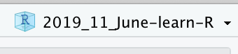

--

### When you click on that button, it comes up with a drop down menu. One of the options is "New Project". Click on that.

---

class: center, middle

###You'll be taken through a screen that asks you a bunch of questions. Make sure you choose "Project", and then choose which directory you'll work out of. For now, go ahead and make it a folder on your desktop, named

###".rainbow[My First Gorgeous R Project]"

(or similar)
---
class: center, middle

## Once you are in your R project, you will click the little icon in the top left that looks like this:

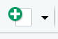
---
class: center, middle

## You should see that the very first option that comes up is "R Script". Click on that, and you'll see a blank document (your R script) enter into your top left pane.

---

# What is an R script?

--

### R Scripts are where you keep all of your important code. They are also where you explain your workings and the code to yourself so that you can remember to do the same thing again later.

---
class: center, middle 

### This is VERY important because you may set down a project and do other things for a few days. If that happens you may forget what you've done and end up doing things over again.

---

class: center, middle

## This is one of the central tenets of modern R: 

--

## .handsome[Make your life as easy as possible!]

---

# To make your life as easy as possible, you should generally have R Scripts that look like this:

--

```{r script}
#12 March 2020: This R Script is an example of what a good R script looks like
##
1+1 #I can't remember what 1+1 is- this way, R will tell me!
```

---
###Another example
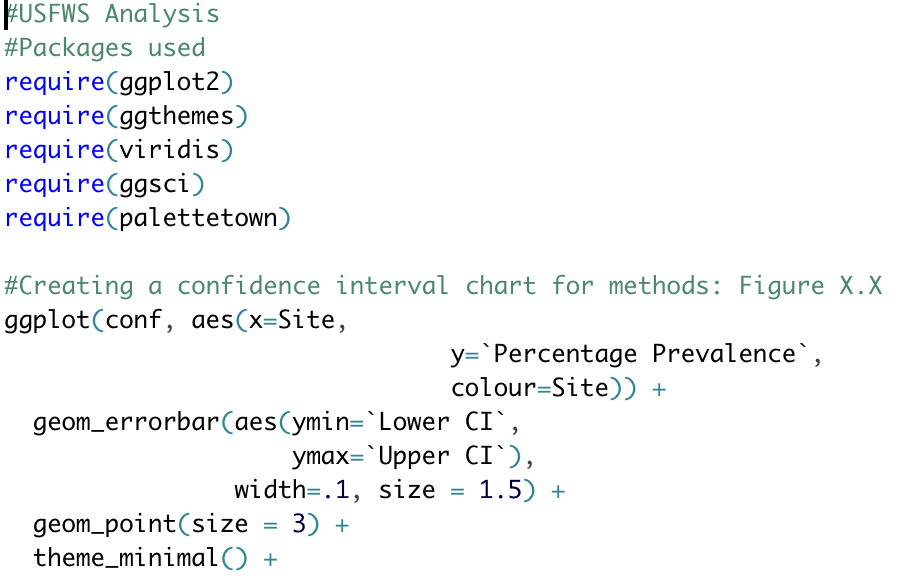

---
class: center, middle

## The conventional wisdom for R Scripts is that you should comment them out with hashes "as though you may be hit on the head at any moment".

---

#How to use R studio

--

### R Studio has a lot of in-built tools that help with effective coding.

--
</br>
### For example, R will automatically close parantheses and quotation marks for you; however, you need to be careful that this doesn't cause mistakes.

--
</br>
### R Studio will also show you when you make a mistake in your R Script, through red lines underlining code and a red "X"

---

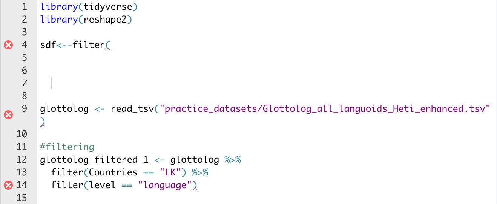

--

You can see here where R is telling you that your code is faulty.

--

You can also see that R Studio will color code differently according to its attribute: a different color for non-code "objects", for comments, and for "significant" commands like telling R which library to use.

---

# Error Codes


---
class: center, middle

## "Start associating error messages with joy because it probably means you are about to learn something!"

---

# What do to do when you get an error code

--

Read the code. This seems self-explanatory but it is where you can gain some understanding of what went wrong. 

--

### As an example, what happens if you type "b" and press enter?

--
</br>
### *You should see "Error: object 'b' not found"*
---

# This message has **three** parts

--

#### 1) It tells us that it is an error

--

#### 2) The location of the error, which is object "b"

--

#### 3) The problem this mistake caused: there is no object b, because I haven't created it!

---

# Sometimes errors are difficult to understand

--

### If you can't understand the error message immediately, then you have several options:

--

1) Check out the help file for the function/command you are using, if applicable

--

2) Google it!

--

3) Ask for help from Stack Overflow (bearing in mind that it can be challenging) or from R-Ladies (if you are a woman)

---
class: center, middle

## Checking out the help file

--

#### The help file can be challenging to understand, so Googling may be the easiest option for you. However, it is important to be familiar with R helpfiles.

---

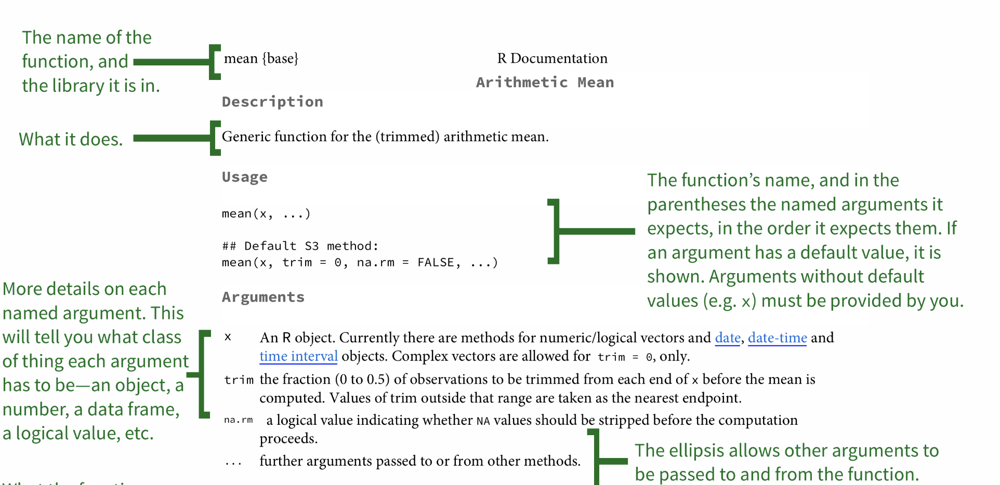

---

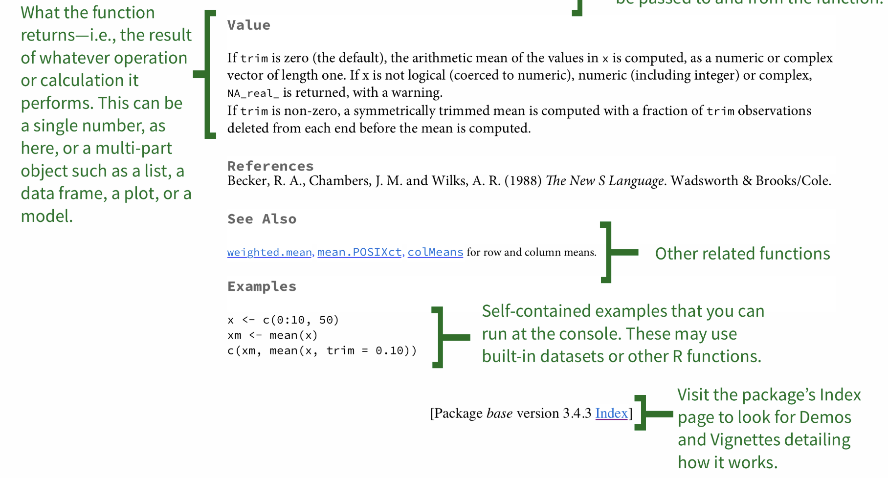

---

# Moving on... What are packages?

--

**Packages** are extra functions or groups of functions that other people have created to help make everyone's life easier. They can be downloaded from CRAN (the R repository) or from GitHub.

--

This is very easy to do. Go ahead and run the following command:

```{r cran}
#install.packages("devtools")
```

---

### You now have the package "devtools" which will allow you to call packages from GitHub. Sometimes packages live on GitHub for somewhat mysterious reasons that I won't get into here.

---

Let's install a package from GitHub. Go ahead and run the following code:

```{r git, message = "false", include = "true", results = "hide"}
#I have hashed it out so that I don't install it
#devtools::install_github("hadley/emo", force = "true")
```

--

You now have the "emoji" package downloaded! Try the following:

```{r emoji}
emo::ji("party")
```

---

class: center, middle

## You are ready to R! `r emo::ji("woman_dancing")`

---
# Getting Data into R
Go to the following site:

https://vincentarelbundock.github.io/Rdatasets/datasets.html 

--

and download the dataset “survival”. We will read this into R using the following command:

```{r 1}
Hanoi<-read.csv("survival.csv")
```

--

When you read this into R, you should see the following:

---


---

###And over in your top right pane, you will see "Hanoi" listed. It tells you how many observations there are (your *n*) and how many variables you have.


---

As you can see, we use the arrow to assign our dataset to a name. Therefore,when you type "Hanoi" it will show you the dataset that you have loaded into R. 

--

However, R Studio makes things very simple by cutting out this extra step. If you look at R Studio, you’ll note that in the top right corner there’s a box that has the tab *“Environment”*. 

You’ll see that there’s a button that says *“Import dataset”*. You can use this button to quickly import any dataset you desire. Try it now with the "survival" dataset you just imported into R as “Hanoi”.

---

class: center, inverse
background-image: url("images/peaceful-fields.png")

---

# A quick, basic lesson

--

Before we go any further, I must stress that R is **very, very particular**. If a command goes wrong, it is 99%<sup>1</sup> probable that you did not **write the name** of the dataset/vector/variable properly, OR that **you did not put a parentheses or a comma**, or some other form of punctuation where there should be one. The beauty of R studio is that it’s very good at putting parentheses in the right places, but errors still do occur.

.footnote[[1] Accurate math]

---

R is quite simply, an entirely new language. That being said, it operates in an intuitive manner. For instance, try the command we had previously in our R Script:

```{r cars, fig.height=4, dev='svg', results='hide'}
1+1
```

--

If you press enter, you'll see that it executes the code and gives you the answer, which is

```{r 2,  echo=FALSE, results='show'}
1+1
```

--

Of course, we all know what 1 + 1 is (but imagine if we didn’t!).

---

# Assigning equations to vectors

Now, what if we wanted to assign the value of the equation **1+1** to an object in R? 

.pull-left[
```{r 3, eval = 'false', results= 'hide'}
a <- 1+1
a
```
]
--

.pull-right[
```{r 3-out, ref.label="3", echo=FALSE}
```
]

--

You can see that the value of this equation is stored in the object of *a*. Now, perhaps you can begin to see what kinds of things you can do with this object, e.g.

---
.pull-left[
```{r 4, results = 'hide', eval = 'false'}
a + 56
```
]

--
.pull-right[
```{r 4-out, ref.label="4", echo=FALSE}
```
]

---
class: center, middle

# R is simple enough to understand if you think of it as small **building blocks**, such as `a <- 1+1`, being put together to comprise a whole (the action you are trying to accomplish).

--

### This may not make sense right now, but (hopefully!) will by the end of this course.

---

# Using R for data analysis

--
</br>
## "Statistics [and data analysis] is a problem-solving and decision-making process that is fundamental to scientific inquiry and essential for making sound decisions."

---
class: center, middle

# Requires **critical thinking** (and practice!)

---

# Taking a look at our dataset

--

Before starting analysis on a dataset, you need to familiarize yourself with the data. This can be done in R very easily. One command that's useful is the following, on our "Hanoi" dataset:

--

.pull-left[
```{r head, eval = 'false', results = 'hide'}
head(Hanoi)
```
]
--

.pull-right[
```{r head-out, ref.label="head", echo=FALSE}
```
]

---

As you can see, this shows you the top of the dataset (the "head", if you will), which is helpful if one wants to get a quick snapshot of the dataset. 

---

The next command is:

--

```{r 5, eval = 'false', results = 'show'}
names(Hanoi)
```

--

Our variables here are "dose" and "survival". To give you some context, this dataset is about the survival of rats after being given radiation doses. "surv" is the survival rate of the batches expressed as a percentage, while "dose" is the dose of radiation administered (rads).

--

Now, it doesn't seem to make sense for our dataset to be called "Hanoi". How do you think we would go about renaming it?

---

```{r 6}
survival <- Hanoi
```

Now, you should see in your top right pane, under "Environment", the dataset `survival`, which is exactly the same as the `Hanoi` dataset.

---

# Summary statistics in R

--

This is very easy to do in R. Simply type the following:

--

```{r 7, eval = 'false', results = 'hide'}
summary(survival)
```


--


```{r 7-out, ref.label="7", echo=FALSE}
```

---

As you can see, this command gives you a nice little snapshot of the data, with means and medians. You can also find the mean for each specific variable by simply typing the following:

.pull-left[
```{r 8, eval = 'false', results = 'hide'}
mean(survival$dose)
```
]

--

.pull-right[
```{r 8-out, ref.label="8", echo=FALSE}
```
]

---

##As you see, this mean is the same as the mean we see in the summary statistics we did with `summary(survival)`.

---

## You probably noticed the use of the "$" operator. This is your way of telling R where to "look". 

--
<br>
###When you type **mean(survival$dose)** you are telling R "I want the mean of the variable *dose* in the *survival* dataset."

--
<br>
Now on your own, try finding the **median** of "surv"

---

You should have typed in the following, and gotten the following result:

--
```{r 9, eval = 'false', results = 'hide'}
median(survival$surv)
```

--

```{r 9-out, ref.label="9", echo=FALSE}

```


---

```{r, out.width = "1400px",echo=FALSE}
knitr::include_graphics("images/bear-vinh.png")

```

---

# How do you make sense of your data?

--

In earlier versions of this lecture, I would tell students to investigate **three key assumptions** (namely, normality, homogeneity of variances, and whether samples were independent).

---

Nowadays, I don't think those are as important. You absolutely should understand your data, but for social scientists our data is 99%<sup>1</sup> of the time going to be non-normal, and often with wide variances. And as social scientists, we should already know whether our data is dependent or independent.

--

.footnote[
[1] Definitely not accurate math.

]

---

class: center, middle

### That being said, it is still important to know what your data looks like

---

We can easily visualize our data with a histogram, using the `hist` command:

--

```{r 11}
hist(survival$surv)
```

---

As you can see, the data really aren’t normally distributed. In fact, the data are right-skewed (i.e. a long right tail).

--

This tells us already that there is *something* going on with our data, so we should expect to see some kind of effect, depending on what we are investigating.

---

### In the old days, we used null hypothesis significance tests (NHST)

--

*These are now rightly criticized for obscuring the "true" effect we can see, and/or being a "lazy" way to interrogate data. Also, there are plenty of instances where it is simply unneccesary to perform NHSTs.*

--

e.g....

---

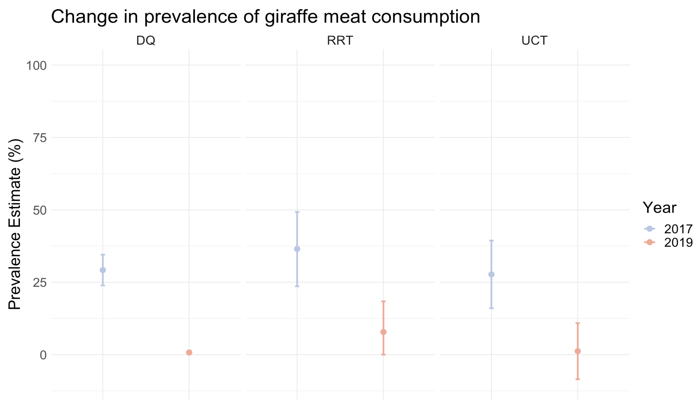


---


# Confidence intervals

--

#### These are really what you should rely on the most. A confidence interval is basically just the mean/prevalence estimate/proportion (**measure we're interested in**), and the **margin of error (ME)** multiplied by **1.96** (for 95% confidence intervals, the standard in social science).

--

### There are plenty of ways to perform confidence intervals in R, although they all are found in packages.

---

## For example, let's say that we want to find the confidence interval for mean survival rate.

--

We will install the package `gmodels`, and perform the following code:

---
.small[
```{r 70, eval = 'false', results = 'hide'}
require(gmodels)
survival$surv <- as.numeric(survival$surv)
ci(survival$surv)
```
]
--

.small[
```{r 70-out, ref.label="70", echo=FALSE}
```
]

---

### We can double check this against the mean of survival, which if you'll remember is found by running:

--

```{r mean surv, eval = 'false'}
mean(survival$surv)
```

--

What this tells us is that our confidence interval of the mean is **(-0.01, 10.1, 20.26)**: indicating that there is a huge amount of variance within this sample!

--

Although of course we already knew that, after seeing how skewed our distrubution was.

---

## As always, having more data points will decrease your level of error.

---

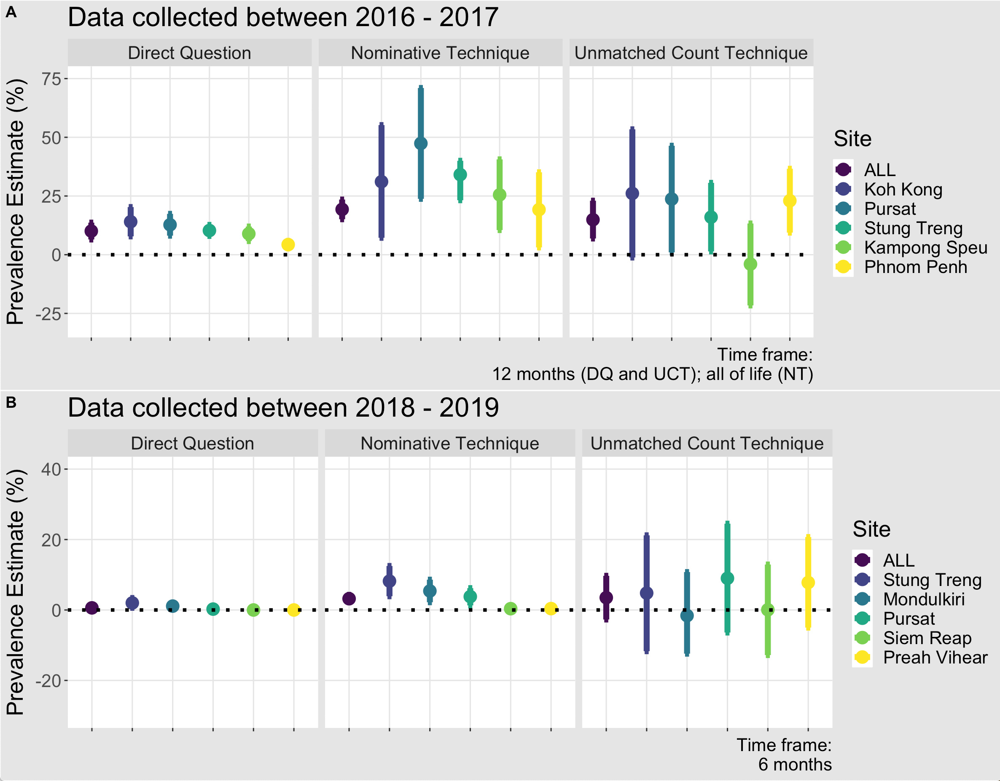

---
class: center, middle

### All NHST tests are a form of linear regression. Linear regression, in turn, can encompass linear models and generalized linear models (GLMs). In social science, we will often be working with GLMs


---

# GLMS

--

### Often seen as scary and traumatic...

--


---

## But in reality, they are pretty simple and even easy- especially with the power of R!

--


---

#GLMs follow the basic formula of:

--

## y ~ x

--

### Where **y** is your dependent variable: e.g. *use of bear bile*, *consumption of giraffe meat*, *whether they've poached in the last year*, etc; and **x** is the independent variables, such as *gender*, *age*, *education*, etc

---

### You also need to know what your distribution looks like, so that you can choose which GLM *family* is appropriate: 

--

**binomial**: if you have a 0,1 dependent variable. For example, "yes" or "no" to using bear bile in the last year

--

**poisson**: count data, also sometimes called frequency. Used if you're exploring the number of times individuals in your sample used bear bile last year

--

**gaussian**: a "normal" distribution. If your dependent variable is something like height, you would use this family


---
### GLM structure

With GLMs, you really need to think through what you're exploring. I have made many mistakes with this, and it has always come down to overcomplicating the model and/or not starting at the "top". It's best is to start with ALL of the variables you want to interrogate, something like:

--

### `bearbile ~ gender + age + province + education + religion`

--

And working your way down based on what is significant.

---

### For example, maybe in your "master model" only gender and education are significant.

--

You should then create a *reduced model*:

--

### `bearbile ~ gender + education`

--

Which will give you more precise estimates of significance.

---

# Interpreting R's GLM output

--

Let's say our GLM is `mylogit <- glm(admit ~ gre + gpa + rank, data = mydata)`, where `admit` is whether a student got admitted to university (0,1), `gre` is their GRE score, `gpa` is of course their undergrad GPA, and `rank` is the relative prestige of the university.

--

.pull-left[
What is the family of this GLM?
]

--

.pull-right[
Correct! It is `binomial`
]

---

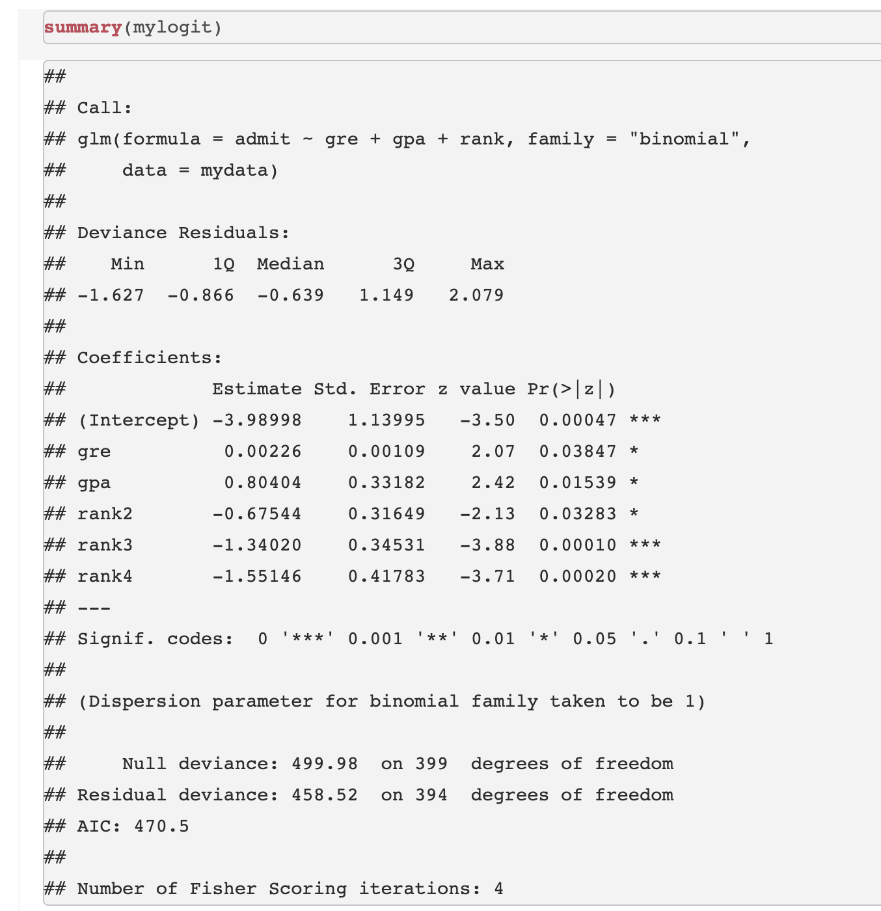

---

## Running your own GLM

--

Go ahead and explore the `mtcars` package in R. What are the variables? What do the data distributions look like? Note: "vs" means the probability of an engine being a certain type, "wt" is weight, and "disp" is "displacement".

--

Now create a GLM with the data. What will you be exploring? (You can create different versions if you like).

--

For example, you could have your model be `glm1 <- glm(vs ~ wt + disp, mtcars, family = binomial)`.

---

###If that was your model, you would then get the following output, when you ran `summary`:

--
.tiny[
```{r glm}
glm1 <- glm(vs ~ wt + disp, mtcars, family = binomial) #making the model

summary(glm1)

```
]

---
### Hopefully you felt confident in interpreting that output! From this, we see that displacement predicts what type of engine a car will have, while weight does not. Specifically, higher displacement means that the probability of a car having a "v-shaped" engine is reduced.

---
## Interaction terms

--

Another aspect of GLMs is "interaction terms". This is denoted by 

.larger[*]

e.g. `gender ~ height * weight`, where you are asking R to investigate the relationship of height and weight and how it predicts gender.

---

### This is yet another example in R where the onus is on the operator ( i.e. you 👈 ) to have a good grasp of your data, as well as your end goal. What are you trying to prove? What exactly are you trying to understand?

--

One of the many wonderful aspects of R is that it really facilitates the kind of exploration that is necessary for understanding data and wriggling your way 🐛 towards enlightenment. It's easy to try different things and make different models- so you may as well do exactly that!

---

class: center, middle

## There is so much that can be done in R. Don't be afraid of exploring, getting things wrong, and googling.

--

### Google will be your best friend when learning R. I still have to Google things ALL the time!

---

Also, there are tons of free resources for learning R! One great example is: https://learningstatisticswithr.com/book/introR.html. 
--
<br><br>
Cleaning data is really important and something I STILL do in Excel... when it can be done so much more easily in R! This is a great resource for learning how to clean data, step by step: https://rladiessydney.org/courses/ryouwithme/
---

class: center, middle

# Great job! You  now know the basics of R!

---
class: center, middle

## Unfortunately, we aren't quite done. 

---

##Visualization is a really important component of analysis and how you communicate your data to the world.

--
</br>
### The easiest way to do this is by using `ggplot2`, Hadley Wickham's amazing "grammar of graphics".

---


---
class: center,middle

.small[How cute is Hadley? He's also a super nice guy and has been instrumental in making R the inclusive environment it is today 🎉]

---

### Some important concepts:

1) "Data visualization is **part art and part science**." - Claus Wilke

--

2) Making a good visualization requires lots of practice and "material osmosis". Explore what other people are doing, get their code, and tinker! 

3) ^ Tied with the above, have fun with it! Make a graph showing all the best Friends episodes or one-liners (as *several* people have done).

---

## Types of graphs

--

1) Scatterplots/line charts -> 

--
.small[
*Generally, this is when you have two continuous/numeric variables that you want to plot against one another, to view a relationship. These are not as common in social science.* 
]
--

2) Barplots ->

--
.small[
*Used for visualizing frequencies and/or proportions. Very common, and not always good- but they CAN be amazing!* 
]
--

3) Boxplots ->

--
.small[
*Used to show distribution spread, and indicating whether there are outliers. Also useful for visualizing confidence intervals.*
]

---
class: center, middle

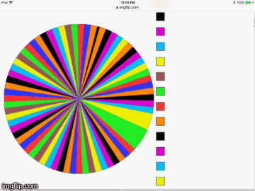

--

### NEVER make one of these abominations.

---
## 🍷

--

<blockquote class="twitter-tweet"><p lang="en" dir="ltr">For <a href="https://twitter.com/hashtag/tidytuesday?src=hash&amp;ref_src=twsrc%5Etfw">#tidytuesday</a> this week, I explored the sweet deal metric (points:price ratio) across all wine types by country, for the 15 countries with the most observations in the dataset. Yeah Chilean wine.<br><br>Code: <a href="https://t.co/WvPS1UtFVE">https://t.co/WvPS1UtFVE</a> <a href="https://t.co/NzMv4jl7Fb">pic.twitter.com/NzMv4jl7Fb</a></p>&mdash; Allison Horst (@allison_horst) <a href="https://twitter.com/allison_horst/status/1133767994360778754?ref_src=twsrc%5Etfw">May 29, 2019</a></blockquote> <script async src="https://platform.twitter.com/widgets.js" charset="utf-8"></script>

---

## Install and/or load the following packages:

--

```{r wine 1}
library(tidyverse)   # All the fun tidy functions!
library(paletteer)
```

--
Now load the data: google "Allison Horst github tidy_tuesday_5_28_19", and a link to the data will come up

--

Or copy this long freaking thing out:

```{r wine 2}
wine_ratings <- readr::read_csv("https://raw.githubusercontent.com/rfordatascience/tidytuesday/master/data/2019/2019-05-28/winemag-data-130k-v2.csv")
```

---
### Follow along with Allison's data manipulation in her github file


--

### You should end up with this plot!


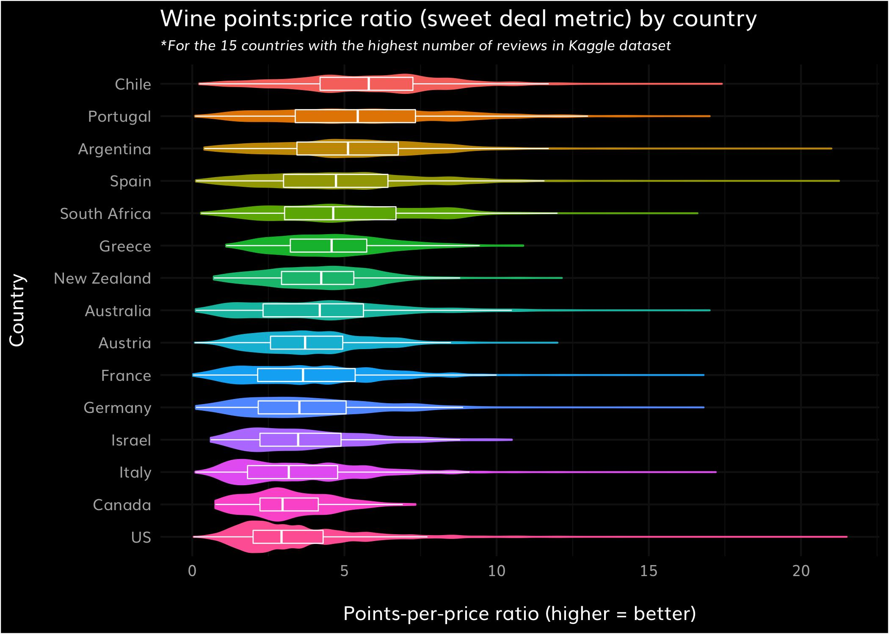

---
class: center, middle

### That probably felt pretty intense, with lots of data manipulation and strange parameters while using ggplot.

--
</br>
###But this is a "new" concept gaining traction among R teachers- maybe we should "let our students eat cake" rather than learning the boring, basic recipes first!

---
class: center, middle

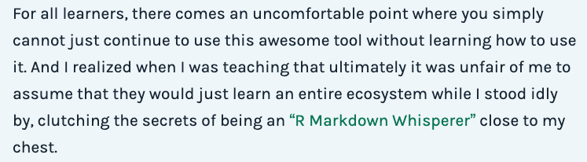

.xsmall[*Alison Hill*, R Guru]

--

.xsmall[Yeah, it's about R markdown, but it still applies!]

---
class: center, middle

### So, I've shown you a hint of what you can do with ggplot2. Like any good ggplotter, it's time for you to slice and dice code and create a Frankenstein monster of your own 🧟<sup>3</sup>

--

.footnote[
[3] Yes, it's a zombie. Close enough.
]

---
class: center, middle

### As you've built your graphs, we've already discussed bits and pieces of the ggplot syntax. However, I'll go through it again/in a little 🤏  more detail here.

---
##`ggplot2` syntax

--

You start with your "foundational" code, which is where you tell ggplot:

--

- the dataset you're using

--

- what variable goes on the x axis

--

- what variable goes on the y axis

--

- what plot you want ggplot to generate

---
class: center, middle

### Up until yesterday, I was going to have you guys explore the `iris` dataset... until I saw on Twitter that this benign, kind of boring dataset was created by a total racist.

--

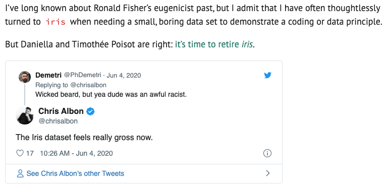

---

### So we'll use something that isn't racist, and has the added benefit of being about penguins ❤️🐧.

--

Load the following code:

```{r penguin}
devtools::install_github("allisonhorst/palmerpenguins")
require(palmerpenguins)
```

---
### Let's make a plot!

--

First, go ahead and explore the data (remember, to load the data from a package you will type `data("penguins")`). Use `head`, `str`, and whatever else you want that will help you understand what's going on in this dataset.

---

```{r ggplot1, eval = TRUE, fig.show = "hide", warning = FALSE}

data("penguins")
require(ggplot2)
ggplot(data = penguins, aes(x = flipper_length_mm, y = body_mass_g)) +
  geom_point(aes(color = species, shape = species))

```

---

`)

---
class: center, middle

### As you saw in the wine price graph, you can spring off this base and add in beautiful color scales, custom themes (or lovely themes people have already created), change your font size, etc.

--
</br>
### This is done by simply adding to your foundational base with "+" and the parameter you want to manipulate.

---

### For example, let's say you want to make the text bigger on your little graph above.

--
Here is what you have done:
```{r ggplot2, eval = FALSE}
g1 <- ggplot(data = penguins, 
                       aes(x = flipper_length_mm,
                           y = body_mass_g)) +
  geom_point(aes(color = species, 
                 shape = species))
```

--

Here is what you now will add:

--

```{r ggplot 3, eval = FALSE}
ggplot(data = penguins, 
                       aes(x = flipper_length_mm,
                           y = body_mass_g)) +
  geom_point(aes(color = species, 
                 shape = species)) +
        theme(text = element_text(size=15)) + #<<
  labs(caption = "Data by Allison Horst")  
```

---
class: center, middle

## Easy!

--

### Building ggplots is an *iterative* process, where you build and tweak according to your needs. 

---

#### Let's move into practicing on your own. You can either stick with the penguins, or explore a dataset R already has, such as the `mpg` dataset.

--
e.g. 
```{r mpg viz 1}
data(mpg)
```

--

Remember what we did earlier. How would you explore this dataset? 

--
</br> </br> </br>
.xsmall[
Correct! `head`, `summary`, and `str` are all good options]

---
class:center, middle

### Now go ahead and think through how you would visualize aspects of this dataset, and what you're interested in. Does it make sense to do a scatterplot? Would a bar chart be useful?

--
</br>
### Use the code we used for the wine price graph, but also look at google [hint: lots of people have made graphs of the mpg dataset]

---
class: center, middle

### When you think you're done and you've made a pretty graph, show your work!
---
background-image: url("images/finalslide.jpg")
background-position: center
background-size: contain


